

    

# 포트폴리오 소개
- 주색: #fee500
- 벤치마킹 사이트 : https://store.kakao.com/kakaofriends

  

# 페이지 구성
## 1. 메인페이지
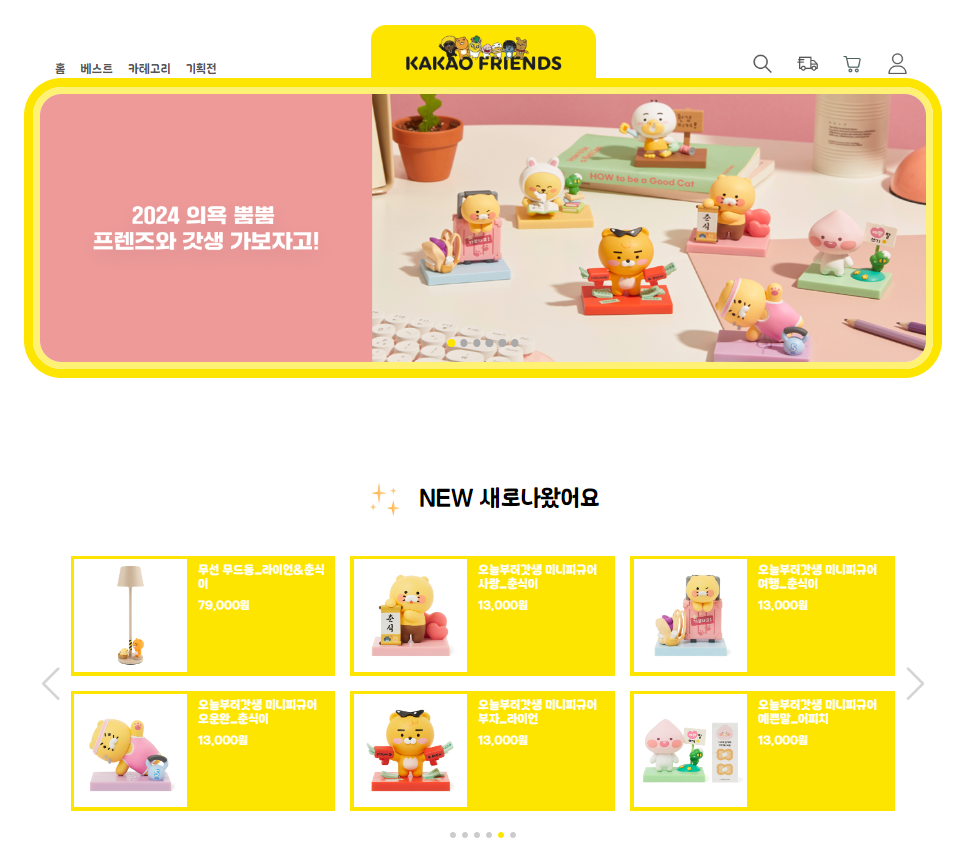
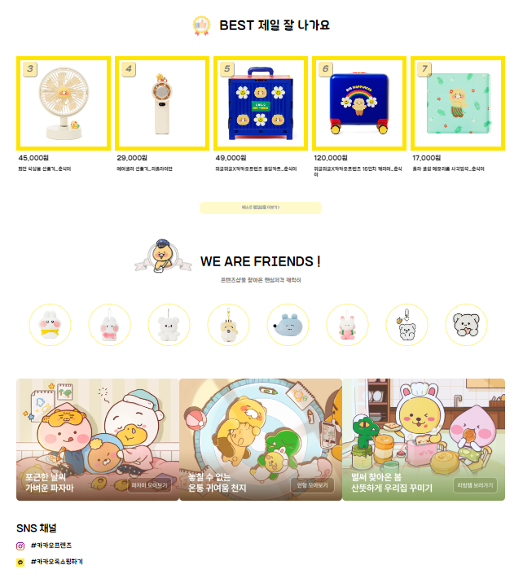

#### 메인베너 
- 자동으로 3초동안 메인베너가 바뀌고 메인베너로 마우스 올라가면 자동 슬라이드가 멈춥니
다. 
- 버튼으로 이전 다음으로 슬라이드, 해당 부분 버튼 클릭 시 해당 베너로 이동합니다. 
- 메인베너 왼쪽 하단의 + 버튼 클릭 시 메뉴바가 나타나며 x 버튼으로 바뀌고 x 버튼 클릭 시 메뉴바가
사라지며 다시 + 버튼으로 바뀝니다.

- 메뉴 클릭 시 해당 페이지로 이동합니다.
- 스크롤 시 헤더 부분이 고정으로 바뀝니다. 
- 스와이퍼로 작업했고 각각 다른 초 동안 화면이 바뀝니다. 

- 오른쪽 하단의 top 버튼은 고정으로 버튼 클릭 시 최상단으로 이동합니다. 
- Footer의 약관 클릭 시 카카오톡 이용약관으로 새 창이 열립니다.

- 반응형 
모바일 화면에서는 메뉴바가 햄버거 버튼으로 바뀌고 버튼 클릭 시 판이 100%로 나오고 닫기 버튼을 누르면 옆으로 사라집니다.

## 2. 상세페이지
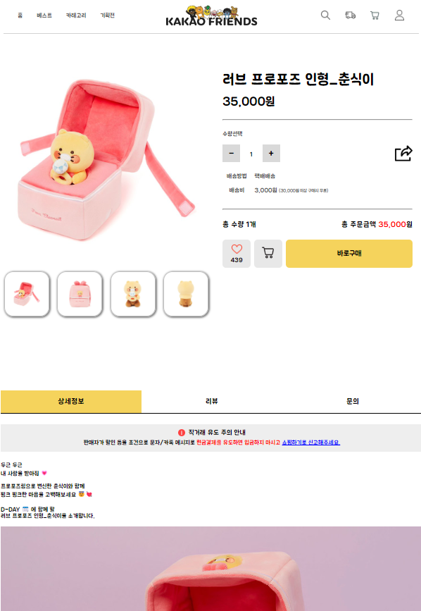
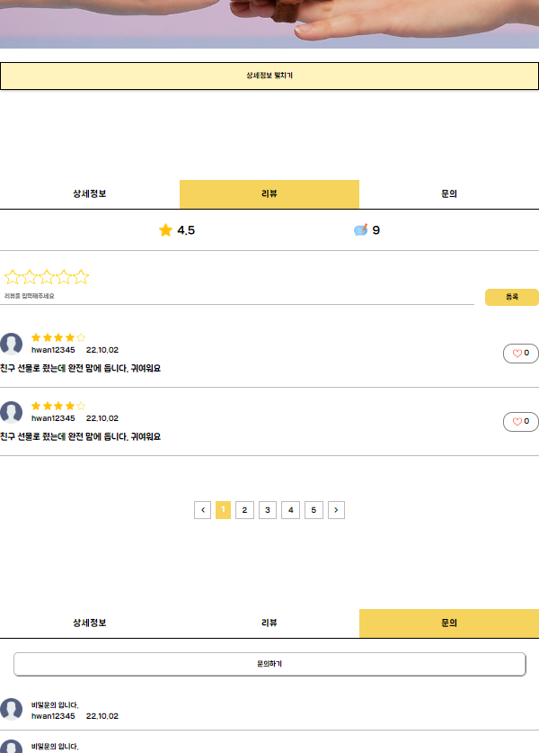

#### 제품 - 수량계산
- 수량선택에서 – 버튼 클릭 시 수량감소, + 버튼 클릭 시 수량증가, 수량 직접 입력 가능합니다.
- 수량에 맞게 총 주문금액 계산해서 출력합니다.
#### 제품 - 버튼
- 공유하기 버튼 클릭 시 해당 링크를 복사합니다.
- 하트 버튼 클릭 시 좋아요 누르고 배경 있는 하트로 변경하고 숫자가 1 증가합니다. 
- 장바구니 버튼 클릭 시 “장바구니에 담겼습니다. 이동하시겠습니까?” 메시지 출력 후 확인 버튼 클릭 시
장바구니 페이지로 이동합니다.
#### 상세정보 / 리뷰 
- 상세 이미지 (작은 이미지) 호버 시 강조 효과를 줍니다. 
- 상세정보/리뷰/문의 클릭 시 해당 부분으로 이동합니다. 
- 상세정보 펼치기 버튼 클릭 시 상세정보를 모두 볼 수 있고 상세정보 접기로 텍스트가 바뀝니다. 
- 리뷰 작성 버튼 클릭 시 별점과 리뷰내용 빈칸 확인 후 빈칸이면 확인 메시지를 띄워줍니다.
- 리뷰에 좋아요 버튼 클릭 시 하트 변경되고 수량 1 증가합니다.
- 리뷰에 페이지네이션으로 해당 버튼 누르면 선택된 부분의 배경색이 바뀝니다. 

## 3. 베스트페이지
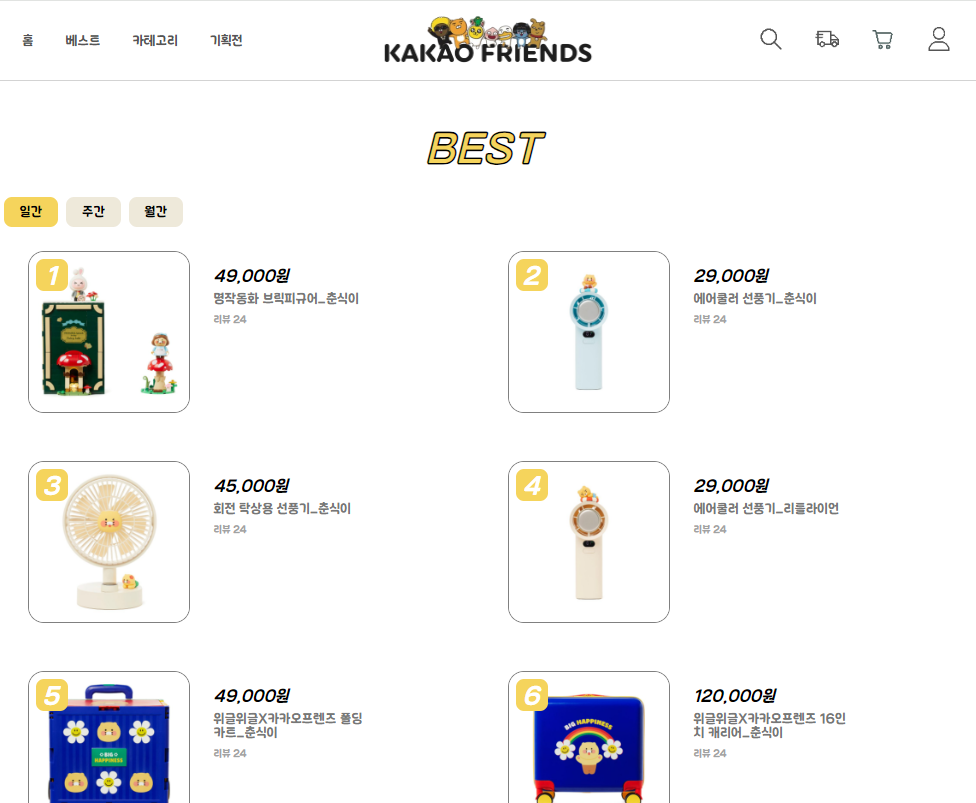

## 4. 카테고리페이지
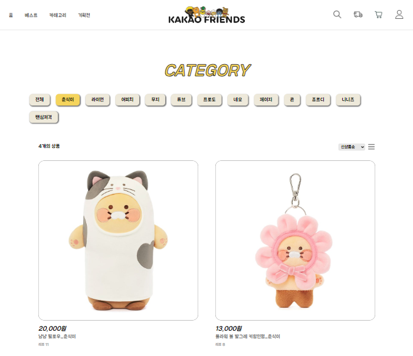
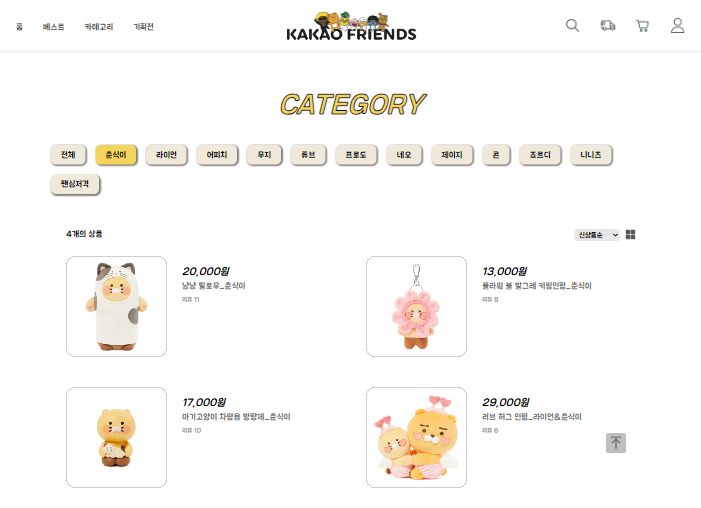

#### 버튼 
- 전체 버튼을 누르면 전체가 선택되고 다시 누르면 전체 선택이 해제됩니다. 
- 각각의 아이템을 눌러 선택할 수 있습니다.
#### 정렬
- 신상품순/인기순으로 선택할 수 있습니다.
- 보는 방식을 두 가지로 선택해서 볼 수 있습니다.
#### 출력 / 효과
- 전체 상품의 개수를 출력합니다.
- 아이템의 이미지에 호버 시 빈 하트 이미지가 나오고 그 이미지에 호버 시 색 하트 이미지가 보여집니다. 이미지 클릭 시 좋아요 버튼으로 색 하트 이미지가 계속 보여지게 됩니다.

## 5. 주문페이지
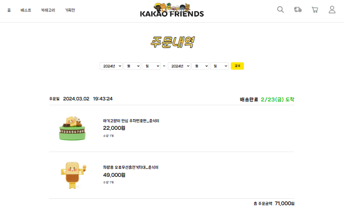
- 상단에 주문날짜를 선택해서 지정된 날짜를 선택할 수 있습니다. 
- 주문금액과 수량에 따라 총 주문금액을 계산해서 출력해줍니다.

## 6. 장바구니페이지
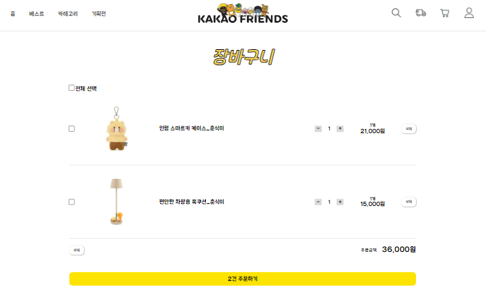
- 전체선택을 체크하면 모든 체크박스가 체크됩니다. 
- 수량선택에서 – 버튼은 수량감소, + 버튼은 수량증가 되고 직접 입력 가능하며 해당 개수와 금액을 출
력해줍니다. 
- 삭제 버튼 클릭 시 각각의 아이템을 삭제할 수 있고 체크한 후 선택삭제가 가능합니다. 
- 총 주문금액을 계산해주고 아이템 수를 계산해서 출력합니다.

## 7. 검색 페이지
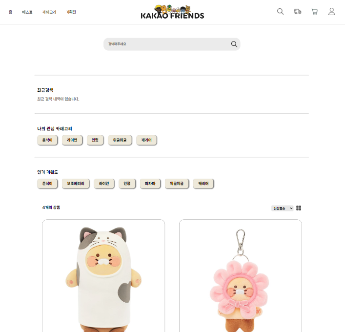

## 8. 로그인/회원가입 페이지
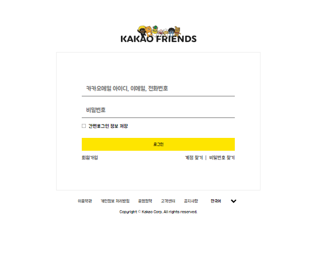
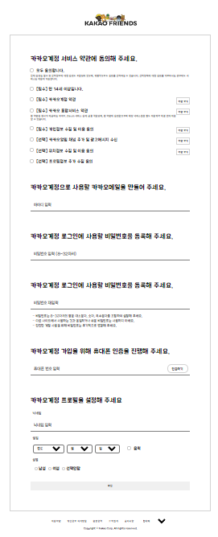

- 로그인 페이지에서 빈칸으로 로그인 버튼 클릭 시 빈칸인 곳에 경고창을 띄워줍니다. 
- 모두 동의합니다 버튼 클릭 시 체크박스 전체가 체크됩니다. 
- 빈칸으로 버튼 클릭 시 경고 메시지를 띄워줍니다.
- 글자 수와 비밀번호 일치 여부, 전화번호 형식(010) 확인 후 불일치할 경우 경고 메시지를 다르게 띄워줍니다. 
- 유효성 검사 후 회원가입 버튼 누르면 회원가입 페이지로 이동합니다.
- 생년월일 칸에서 오늘 년도를 구해 100년 이내의 연도만 출력하고 월에 따라 일의 선택 옵션이 달라지게 합니다. 

